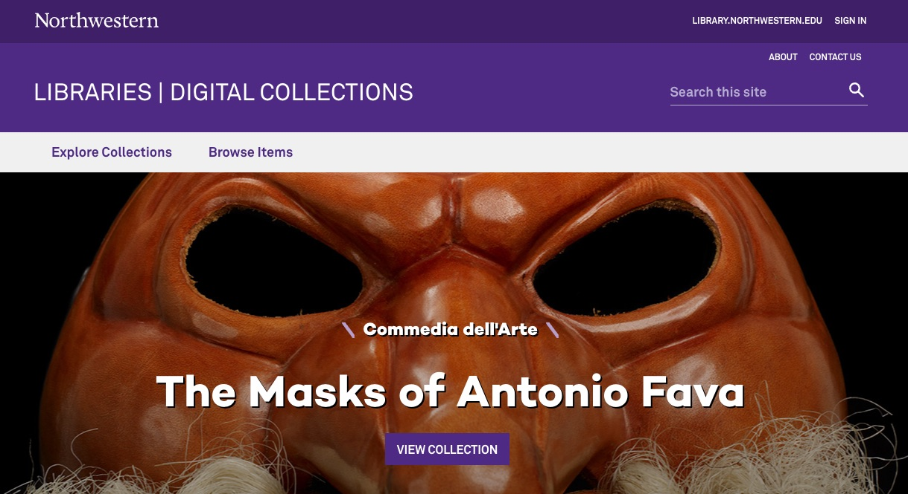

# Digital Collections

[](https://github.com/nulib/digital-collections/actions/workflows/build.yml) [](https://coveralls.io/github/nulib/digital-collections?branch=deploy/staging)



Digital Collections is a single page application serving as the presentation layer for our new ingestion application, [Meadow](https://github.com/nulib/meadow). Digital Collections contains discovery UI components for searching, filtering, browsing and navigating of items against an AWS Elasticsearch index.

## Getting Started

These instructions will get you a copy of the project up and running on your local machine for development and testing purposes. See deployment for notes on how to deploy.

### Prerequisites

[Node.js](https://nodejs.org/) must be installed on your system.

### Installing

```bash
git clone git@github.com:nulib/digital-collections.git
cd digital-collections

git checkout deploy/staging
npm run install
```

## Running a local development environment

### Against production data

```bash
npm run start:use-real-data  // Run against production data
npm run start:use-staging-data  // Run against staging data
```

The Digital Collections Fen application will be available at: https://devbox.library.northwestern.edu:3333/

#### Elasticsearch API

To view the Elasticsearch index via Kibana, run the following to autheticate with AWS and initiate `es-proxy`:

```
// Example to view Staging environment Elasticsearch data
export AWS_PROFILE=staging
aws-adfs login  --profile=$AWS_PROFILE

// Now start es-proxy which will output a local Kibana URL
es-proxy

```

The command will output a link, which you can copy and paste in your browser to view the Elasticsearch index, via Kibana.

## Running the tests

### End to end tests

Cypress (coming soon)

### Unit Tests

Unit tests are handled via Jest and @testing-library:
https://facebook.github.io/jest/

If your dev environment is Mac OSX, you'll need to install `watchman` to run the tests (at this current time). If you use HomeBrew:

```
brew install watchman
```

Then to run unit tests:

```
npm run test
```

## Deployment / CI

Merging a feature branch into the `deploy/staging` branch will automatically update the staging environment (https://dc.rdc-staging.library.northwestern.edu/)

Merging `deploy/staging` into `master` will automatically update the production environment.

## ADR

To document architecture decisions, we use the [adr-tools](https://github.com/npryce/adr-tools) package. To document a new architecture decision via `adr-tools` markdown template generator, run:

```
adr new your-text-here
```

## Built With

- ReactJS - UI component library
- ReactiveSearch - Elasticsearch components library package
- Jest - Unit testing
- Northwestern Global Marketing design templates

## Contributing

Please read CONTRIBUTING.md for details on our code of conduct, and the process for submitting pull requests to us.

## Authors

- Adam J. Arling <aarling@gmail.com>
- Karen Shaw <karendid@gmail.com>
- Brendan Quinn <brendan-quinn@northwestern.edu>
- Michael B. Klein <mbklein@gmail.com>

## License

This project is licensed under the MIT License - see the LICENSE.md file for details
